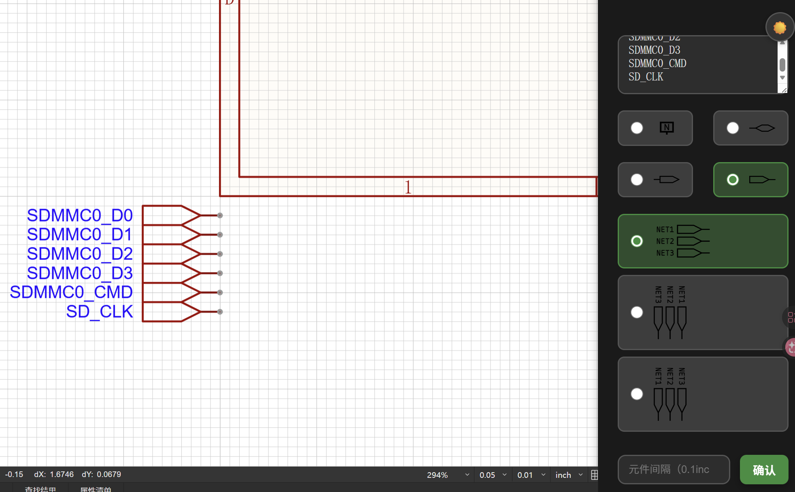

# 批量放置输入、输出、双向符号。

当你获取一张核心板的原理图时

一定在苦恼于放置网络标签

> 由于目前没有获取网格尺寸的方法
> 我使用了默认0.05inch为最小单位（1/2输入符号高度）

> 网络标签功能由于没有相关api 也是不能使用

## 截图ocr或复制
截图ocr可以用PixPin（贴图的时候可以复制）

将网络标签用回车间隔

## 如果想这样放 就全选 按两下空格

